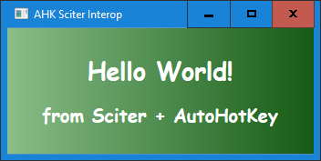

# Sciter + AutoHotKey

Simple demo based on [this forum post](https://sciter.com/forums/topic/scitersharp-with-autohotkey/).

## Instructions

Place [SciterSharpWindows.dll](https://www.nuget.org/packages/SciterSharpWindows) and [sciter.dll](https://github.com/c-smile/sciter-js-sdk/blob/e1909ed966b585466bd235994f00a80ed58f30df/bin/windows/x64/sciter.dll) inside this folder.

Then run [main.ahk](main.ahk) with [AutoHotKey](https://www.autohotkey.com/).

## Preview

